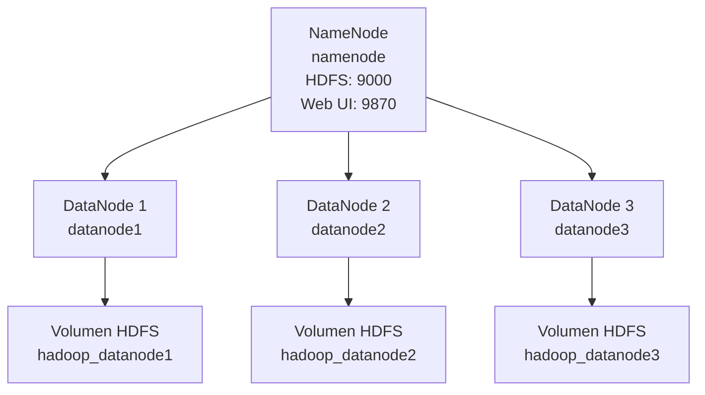

# LG15 - Tolerancia a Fallos y Replicación de Datos en HDFS

## Universidad del Valle

**Grupo:** 3  
**Asignatura:** Tecnologías Emergentes  
**Práctica:** LG15 - Tolerancia a fallos y replicación de datos en HDFS

---

## 1. Objetivo

Implementar un entorno distribuido Hadoop HDFS compuesto por un NameNode y tres DataNodes, utilizando un factor de replicación de 2, para analizar experimentalmente el comportamiento de HDFS ante la caída de un DataNode.

Las pruebas se realizaron utilizando dos datasets:

- Dataset de 1 GiB.
- Dataset de 10 GiB.

Durante los experimentos se analizó la distribución de bloques, las réplicas existentes, la disponibilidad de los archivos y el proceso de recuperación automática de HDFS.

---

## 2. Arquitectura

El clúster utilizado está compuesto por:

| Componente | Cantidad |
|---|---:|
| NameNode | 1 |
| DataNodes | 3 |
| Factor de replicación | 2 |
| Dataset 1 | 1 GiB |
| Dataset 2 | 10 GiB |

Arquitectura:



**Factor de replicación HDFS: 2**

Cada DataNode utiliza un volumen independiente para almacenar los bloques de HDFS.

---

## 3. Tecnologías utilizadas

- Apache Hadoop HDFS
- Docker
- Docker Compose
- Git
- GitHub
- PowerShell
- Visual Studio Code

El entorno se basó inicialmente en el proyecto Big-Data-Cluster y fue adaptado para los requerimientos de la práctica LG15 del Grupo 3.

---

## 4. Configuración HDFS

El factor de replicación utilizado fue:

```text
dfs.replication = 2
```

La configuración puede comprobarse mediante:

```bash
docker exec namenode hdfs getconf -confKey dfs.replication
```

Resultado obtenido:

```text
2
```

El estado del clúster se comprobó mediante:

```bash
docker exec namenode hdfs dfsadmin -report
```

Antes de las pruebas de fallo se verificaron:

```text
Live datanodes (3)
```

---

## 5. Estructura HDFS del Grupo 3

Se utilizó la siguiente estructura:

```text
/grupo3/
├── dataset_1GB/
├── dataset_10GB/
├── resultados/
└── evidencias/
```

Los datasets fueron identificados como:

```text
dataset_grupo3_1GB
dataset_grupo3_10GB
```

---

# 6. Experimento 1 - Dataset de 1 GiB

## Estado inicial

El archivo utilizado fue:

```text
/grupo3/dataset_1GB/dataset_grupo3_1GB
```

El análisis mediante:

```bash
hdfs fsck /grupo3/dataset_1GB/dataset_grupo3_1GB -files -blocks -locations
```

mostró:

| Característica | Resultado |
|---|---:|
| Tamaño | 1,073,741,824 bytes |
| Tamaño de bloque | 128 MiB |
| Número de bloques | 8 |
| Factor de replicación | 2 |
| Replicación promedio | 2.0 |
| Bloques perdidos | 0 |
| Estado | HEALTHY |

Los bloques fueron distribuidos entre los tres DataNodes.

## Prueba de fallo

Se detuvo el DataNode 2:

```bash
docker stop datanode2
```

Docker confirmó que el contenedor se encontraba detenido.

Después del tiempo necesario para la detección de la falla, el NameNode reportó solamente dos DataNodes activos.

El archivo continuó disponible.

Se comprobó su lectura completa mediante:

```bash
docker exec namenode bash -c "hdfs dfs -cat /grupo3/dataset_1GB/dataset_grupo3_1GB > /dev/null"
```

El código de salida obtenido fue:

```text
0
```

Esto demuestra que el archivo pudo ser leído correctamente aunque uno de los DataNodes estuviera fuera de servicio.

## Recuperación

Al ejecutar nuevamente `fsck` con dos DataNodes disponibles se obtuvo:

```text
Number of data-nodes: 2
Total blocks: 8
Under-replicated blocks: 0
Default replication factor: 2
Average block replication: 2.0
Missing blocks: 0
Status: HEALTHY
```

Para el momento en que se obtuvo la evidencia, HDFS ya había reconstruido automáticamente las réplicas necesarias utilizando los DataNodes supervivientes.

---

# 7. Experimento 2 - Dataset de 10 GiB

El segundo archivo utilizado fue:

```text
/grupo3/dataset_10GB/dataset_grupo3_10GB
```

Resultados iniciales:

| Característica | Resultado |
|---|---:|
| Tamaño | 10,737,418,240 bytes |
| Tamaño de bloque | 128 MiB |
| Número de bloques | 80 |
| Factor de replicación | 2 |
| Bloques perdidos | 0 |
| Estado | HEALTHY |

Se detuvo nuevamente:

```text
DataNode 2
```

Después de que el NameNode detectó la caída se observaron dos DataNodes disponibles.

El análisis posterior mostró:

```text
Number of data-nodes: 2
Total blocks: 80
Under-replicated blocks: 0
Default replication factor: 2
Average block replication: 2.0
Missing blocks: 0
Status: HEALTHY
```

HDFS había reconstruido las réplicas entre los DataNodes supervivientes.

---

# 8. Comparación de experimentos

| Característica | Dataset 1 GiB | Dataset 10 GiB |
|---|---:|---:|
| Tamaño | 1 GiB | 10 GiB |
| Número de bloques | 8 | 80 |
| Tamaño de bloque | 128 MiB | 128 MiB |
| Factor de replicación | 2 | 2 |
| DataNode afectado | DN2 | DN2 |
| DataNodes disponibles durante la falla | 2 | 2 |
| Bloques perdidos | 0 | 0 |
| ¿Archivo accesible? | Sí | Sí |
| ¿Archivo legible? | Sí | Sí |
| Subreplicados en el `fsck` capturado | 0 | 0 |
| Replicación promedio observada | 2.0 | 2.0 |
| Estado observado | HEALTHY | HEALTHY |

El dataset de 10 GiB generó diez veces más bloques que el dataset de 1 GiB, permitiendo observar una distribución de bloques más representativa de un sistema distribuido.

---

# 9. Preguntas de análisis

## Pregunta 1: ¿Por qué HDFS puede continuar proporcionando el archivo aunque un DataNode haya fallado?

Porque HDFS almacena réplicas de los bloques en diferentes DataNodes. Con un factor de replicación de 2, cada bloque dispone normalmente de dos réplicas. Si uno de los DataNodes falla, HDFS puede obtener el bloque desde otra réplica disponible.

## Pregunta 2: ¿Qué habría ocurrido si el factor de replicación hubiera sido 1?

Cada bloque tendría una única copia. Si el DataNode que contiene ese bloque falla, dicho bloque dejaría de estar disponible. Si el archivo necesita ese bloque, el archivo completo no podría leerse correctamente.

## Pregunta 3: ¿Qué habría ocurrido si hubieran fallado dos DataNodes simultáneamente?

Con factor de replicación 2 existe la posibilidad de que ambas réplicas de determinados bloques estuvieran precisamente en los dos DataNodes que fallaron. Esos bloques quedarían temporalmente indisponibles y el archivo no podría leerse completamente.

## Pregunta 4: ¿Por qué un factor de replicación de 2 no significa necesariamente que existan dos copias completas del archivo en dos DataNodes?

Porque HDFS realiza la replicación por bloques, no por archivos completos. Las réplicas de distintos bloques pueden distribuirse entre diferentes DataNodes.

## Pregunta 5: ¿Cuál es la relación entre tamaño de bloque y número de bloques?

El número de bloques depende aproximadamente de:

```text
Número de bloques = ceil(Tamaño del archivo / Tamaño del bloque)
```

Con bloques de 128 MiB:

```text
1 GiB  -> 8 bloques
10 GiB -> 80 bloques
```

## Pregunta 6: ¿Por qué el dataset de 10 GB permite observar un comportamiento más representativo?

Porque genera una cantidad mayor de bloques. Esto produce más oportunidades de distribución y replicación entre los DataNodes y representa mejor el comportamiento de almacenamiento distribuido de HDFS.

## Pregunta 7: ¿Qué sucede con los bloques que tenían una réplica en el DataNode que falló?

La réplica almacenada en el nodo caído deja de estar disponible. El NameNode detecta la reducción de réplicas y puede ordenar la creación de nuevas réplicas a partir de las copias que permanecen disponibles.

## Pregunta 8: ¿Quién administra la ubicación y replicación de los bloques?

El **NameNode** mantiene los metadatos relacionados con los archivos y bloques y coordina la replicación. Los DataNodes almacenan físicamente los bloques y ejecutan las operaciones indicadas por el NameNode.

## Pregunta 9: ¿Qué diferencia existe entre disponibilidad del archivo y cumplimiento del factor de replicación después de una falla?

La disponibilidad indica si todavía existen suficientes bloques para leer completamente el archivo.

El cumplimiento del factor de replicación indica si cada bloque mantiene el número configurado de réplicas.

Por lo tanto, un archivo puede continuar disponible aunque temporalmente algunos bloques tengan menos réplicas de las configuradas.

---

# 10. Evidencias

Los resultados obtenidos durante las pruebas se encuentran en:

```text
grupo3/resultados/
```

Se almacenaron reportes de:

- Estado antes de la falla.
- Estado durante la falla.
- Estado después de la recuperación.
- Distribución de bloques.
- Ubicación de réplicas.
- Estado de los DataNodes.

Se utilizaron principalmente:

```bash
hdfs dfsadmin -report
hdfs fsck <archivo> -files -blocks -locations
```

---

# 11. Conclusiones

Las pruebas demostraron experimentalmente el mecanismo de tolerancia a fallos de HDFS.

Con un factor de replicación de 2, la caída de un DataNode no provocó la pérdida de los archivos de 1 GiB y 10 GiB. Las réplicas existentes permitieron continuar leyendo los datasets.

Después de que el NameNode detectó la falla, HDFS utilizó los DataNodes disponibles para recuperar el nivel de replicación requerido. Para el momento en que se ejecutaron las comprobaciones `fsck`, los archivos presentaban nuevamente una replicación promedio de 2.0 y estado `HEALTHY`.

El experimento también mostró que el dataset de 10 GiB produjo 80 bloques frente a los 8 bloques del dataset de 1 GiB, generando una distribución de datos más representativa del funcionamiento de un sistema de almacenamiento distribuido.